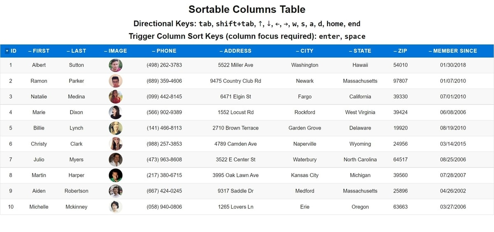
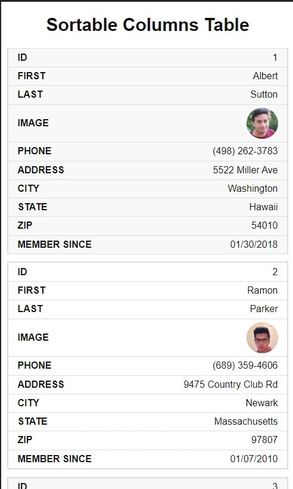

# Sortable Columns Table

## Table Of Contents

- [Sortable Columns Table](#sortable-columns-table)
  - [Table Of Contents](#table-of-contents)
  - [Overview](#overview)
    - [The Challenge](#the-challenge)
      - [Bonus](#bonus)
    - [Screenshot](#screenshot)
      - [Desktop View](#desktop-view)
      - [Mobile View](#mobile-view)
    - [Links](#links)
  - [My Process](#my-process)
    - [Built with](#built-with)
    - [What I Learned](#what-i-learned)
      - [API Memoization](#api-memoization)
      - [Sorting Memoization](#sorting-memoization)
      - [Loading Screen](#loading-screen)
    - [Continued Development](#continued-development)
    - [Useful Resources](#useful-resources)
  - [Author](#author)
  - [Acknowledgments](#acknowledgments)

## Overview

### The Challenge

Users should be able to:

- See a table with user information or an error message
- Be able to click on all the column headers to sort it by that column

#### Bonus

### Screenshot

#### Desktop View



#### Mobile View



### Links

- Solution URL: [GitHub Repo](https://github.com/abuna1985/sortable-columns-table/)
- Live Site URL: [GitHub Pages](https://abuna1985.github.io/sortable-columns-table/)

## My Process

### Built with

- Semantic HTML5 markup
- CSS custom properties
- ES6 JavaScript

### What I Learned

#### API Memoization

#### Sorting Memoization

#### Loading Screen

Use this section to recap over some of your major learnings while working through this project. Writing these out and providing code samples of areas you want to highlight is a great way to reinforce your own knowledge.

To see how you can add code snippets, see below:

```html
<h1>Some HTML code I'm proud of</h1>
```

```css
.proud-of-this-css {
  color: papayawhip;
}
```

```js
const proudOfThisFunc = () => {
  console.log("🎉");
};
```

If you want more help with writing markdown, we'd recommend checking out [The Markdown Guide](https://www.markdownguide.org/) to learn more.

### Continued Development

Use this section to outline areas that you want to continue focusing on in future projects. These could be concepts you're still not completely comfortable with or techniques you found useful that you want to refine and perfect.

### Useful Resources

- [Go Make Things - Event Delegation](https://gomakethings.com/listening-for-events-on-multiple-elements-using-javascript-event-delegation/) - This helped me better understand how event delegation works in JavaScript.
- [Go Make Things - Inject text and HTML with JavaScript](https://gomakethings.com/four-different-ways-to-inject-text-and-html-into-an-element-with-vanilla-javascript/) - This article helped me as a reference.
- [Random User API Documentation](https://randomuser.me/documentation#howto) Here is the documentation for the Random User API for reference.
- [MDN Docs - table-layout](https://developer.mozilla.org/en-US/docs/Web/CSS/table-layout)
- [](https://javascript.info/optional-chaining)
- [](https://codepen.io/Orangetronic/full/pJgpXw)
- [](https://vanillajstoolkit.com/helpers/formatdate/)
- [](https://blog.logrocket.com/animated-page-loaders-css/)
- [](https://masteringjs.io/tutorials/fundamentals/typeof-date)

## Author

- Website - [adamabundis.xyz](https://adamabundis.xyz/)
- GitHub - [@abuna1985](https://github.com/abuna1985)
- Twitter - [@adamabundis](https://twitter.com/adamabundis)

## Acknowledgments

This is where you can give a hat tip to anyone who helped you out on this project. Perhaps you worked in a team or got some inspiration from someone else's solution. This is the perfect place to give them some credit.
